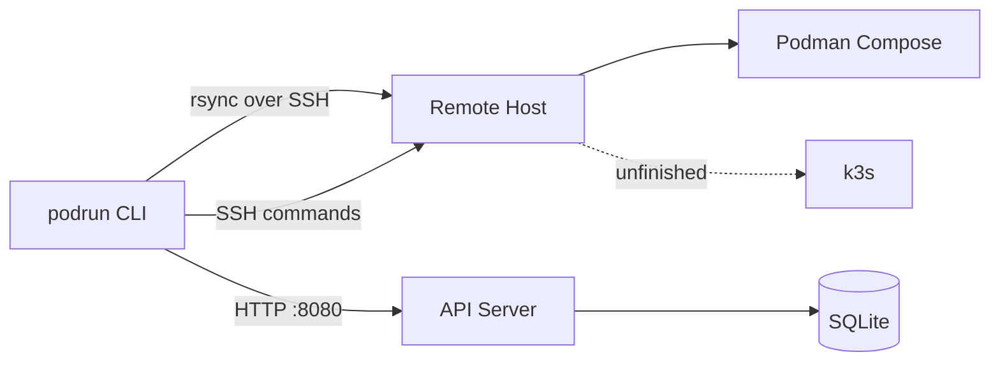

Last updated: 2026-10-06

> [!NOTE]
> This README was generated by [SKILL](https://github.com/agenvoy/skill-readme-generate), get the ZH version from [here](./doc/README.zh.md).

***

<strong>DEPLOY TO REMOTE PODMAN AND K3S LIKE LOCAL DOCKER COMPOSE!</strong>

***

> A Go CLI tool that deploys compose projects to remote Podman and k3s as easily as local docker compose

## Table of Contents

- [Features](#features)
- [Architecture](#architecture)
- [License](#license)
- [Author](#author)

## Features

> `go install github.com/pardnchiu/PodRun/cmd/cli@latest` · [Documentation](./doc/doc.md)

- **One-Command Remote Deploy** — Run the same syntax as docker compose inside a local project; podrun syncs the files and starts the stack with Podman Compose on a remote host that only needs SSH and Podman.
- **Pre-Sync Diff Preview** — When the remote folder already has content, an rsync dry-run lists every file to be added, overwritten, or deleted, and nothing syncs until you confirm.
- **Non-Destructive Compose Rewrite** — A remote `docker-compose.podrun.yml` copy drops host port bindings and appends the SELinux `:z` label to relative-path volumes while the original file stays untouched.
- **Dual Runtime Targets (k3s Unfinished)** — The `--type` flag switches between Podman Compose and k3s so one command set deploys to both environments; k3s is planned and only Podman Compose works today.
- **Traceable Deployment Records** — A hash of the local MAC address and project path yields a stable UID and remote folder, and a built-in Gin + SQLite API server logs every operation with its source host.

> Planned items such as the k3s runtime, Kubernetes `deploy`, `export`, and `domain` are unfinished; see [Implementation Status](./doc/doc.md#implementation-status) for the full picture.

## Architecture

> [Full Architecture](./doc/architecture.md)

```mermaid
graph LR
    CLI[podrun CLI] -->|rsync over SSH| Remote[Remote Host]
    CLI -->|SSH commands| Remote
    Remote --> Compose[Podman Compose]
    Remote -.->|unfinished| K3s[k3s]
    CLI -->|HTTP :8080| API[API Server]
    API --> DB[(SQLite)]
```

## License

This project is licensed under the [AGPL-3.0 LICENSE](LICENSE).

## Author

Just [open an issue](https://github.com/pardnchiu/PodRun/issues/new) to share an idea.

***

©️ 2025 [邱敬幃 Pardn Chiu](https://www.linkedin.com/in/pardnchiu)
