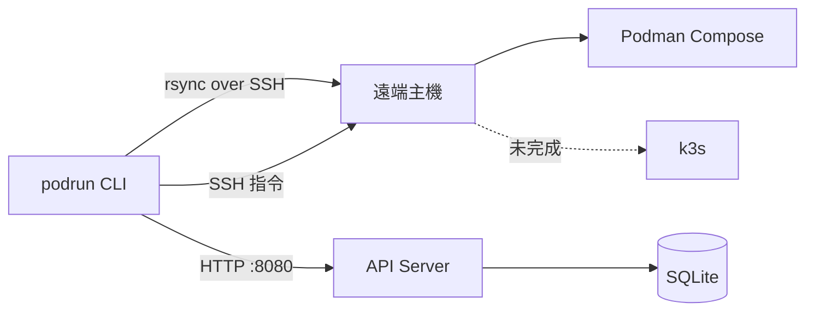

最後更新：2026-10-06

> [!NOTE]
> 此 README 由 [SKILL](https://github.com/agenvoy/skill-readme-generate) 生成，英文版請參閱 [這裡](../README.md)。

***

<strong>DEPLOY TO REMOTE PODMAN AND K3S LIKE LOCAL DOCKER COMPOSE!</strong>

***

> Go CLI 工具，像在本地執行 docker compose 一樣將專案部署到遠端 Podman 與 k3s

## 目錄

- [功能特點](#功能特點)
- [架構](#架構)
- [授權](#授權)
- [Author](#author)

## 功能特點

> `go install github.com/pardnchiu/PodRun/cmd/cli@latest` · [完整文件](./doc.zh.md)

- **一行指令遠端部署** — 在本地專案目錄以 docker compose 相同語法執行，自動同步檔案並在遠端以 Podman Compose 啟動，遠端只需 SSH 與 Podman。
- **同步前差異預覽** — 遠端目錄已有內容時先以 rsync dry-run 列出將被新增、覆寫或刪除的檔案，確認後才實際同步。
- **不動原檔的 Compose 改寫** — 在遠端產生 `docker-compose.podrun.yml` 副本，移除主機 Port 綁定並為相對路徑 Volume 補上 SELinux `:z` 標籤。
- **雙 Runtime 目標（k3s 未完成）** — 以 `--type` 在 Podman Compose 與 k3s 之間切換，同一套指令部署至兩種環境；k3s 為後續實作項目，目前僅 Podman Compose 可用。
- **可追蹤的部署紀錄** — 以本機 MAC 位址與專案絕對路徑雜湊出固定 UID 與遠端目錄，並由內建 Gin + SQLite API Server 記錄每次操作與來源主機。

> k3s Runtime、Kubernetes `deploy`、`export`、`domain` 等規劃項目尚未完成，完整狀態見 [實作狀態](./doc.zh.md#實作狀態)。

## 架構

> [完整架構](./architecture.zh.md)

```mermaid
graph LR
    CLI[podrun CLI] -->|rsync over SSH| Remote[遠端主機]
    CLI -->|SSH 指令| Remote
    Remote --> Compose[Podman Compose]
    Remote -.->|未完成| K3s[k3s]
    CLI -->|HTTP :8080| API[API Server]
    API --> DB[(SQLite)]
```

## 授權

本專案採用 [AGPL-3.0 LICENSE](../LICENSE)。

## Author

Just [open an issue](https://github.com/pardnchiu/PodRun/issues/new) to share an idea.

***

©️ 2025 [邱敬幃 Pardn Chiu](https://www.linkedin.com/in/pardnchiu)
