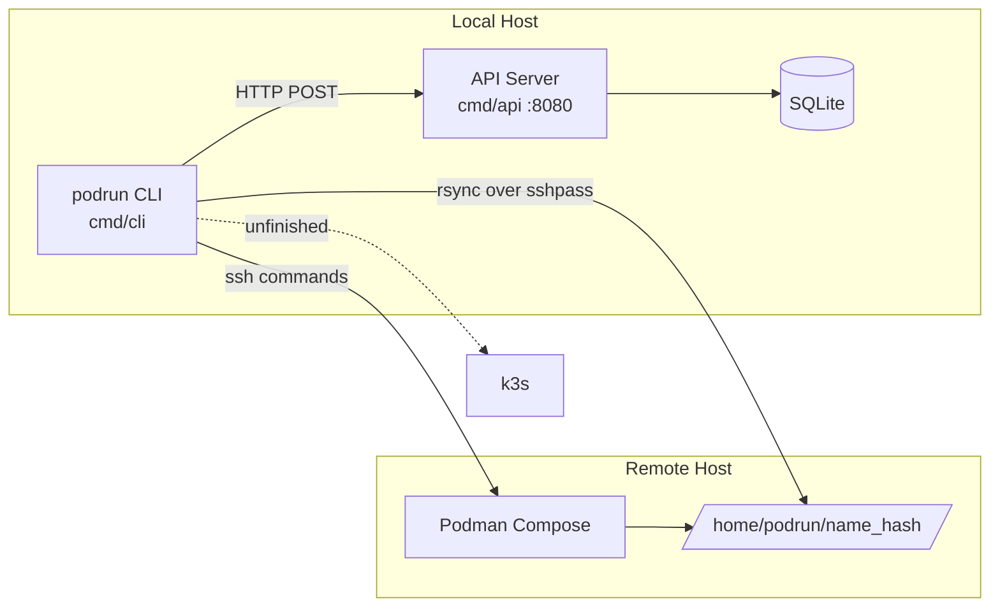
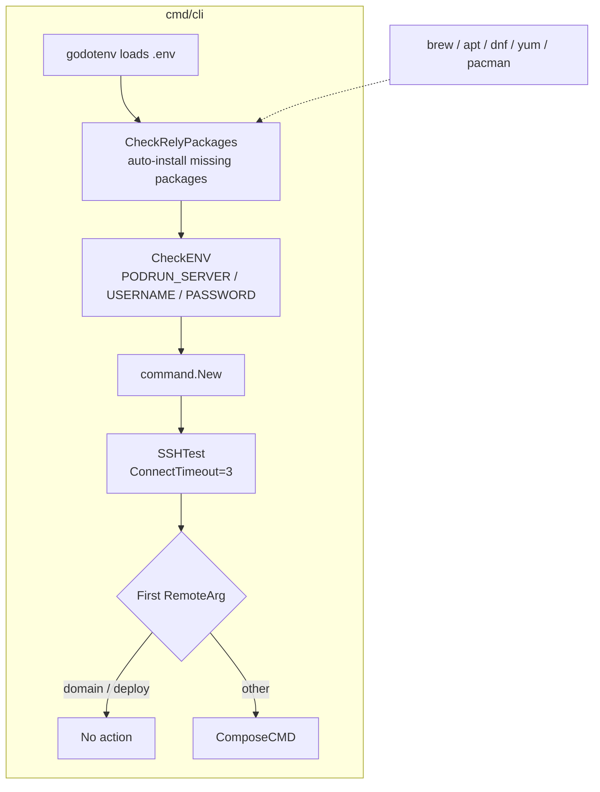
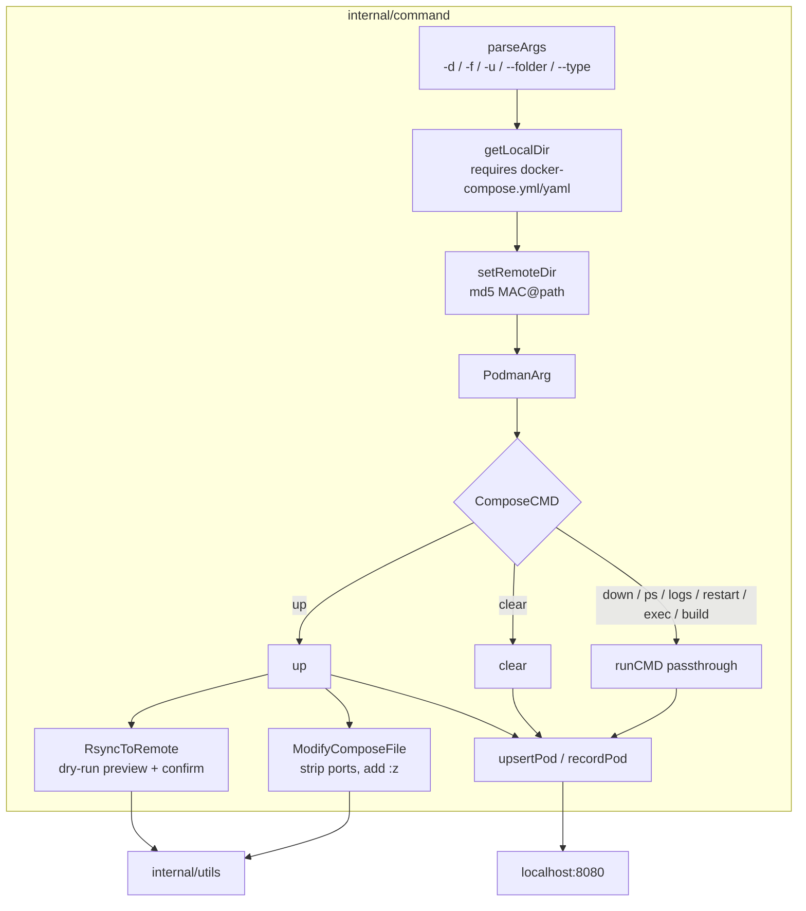
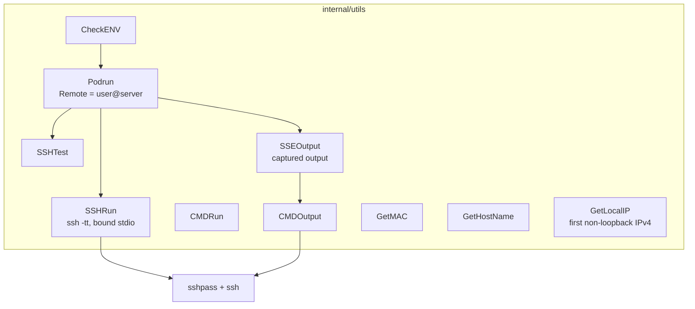
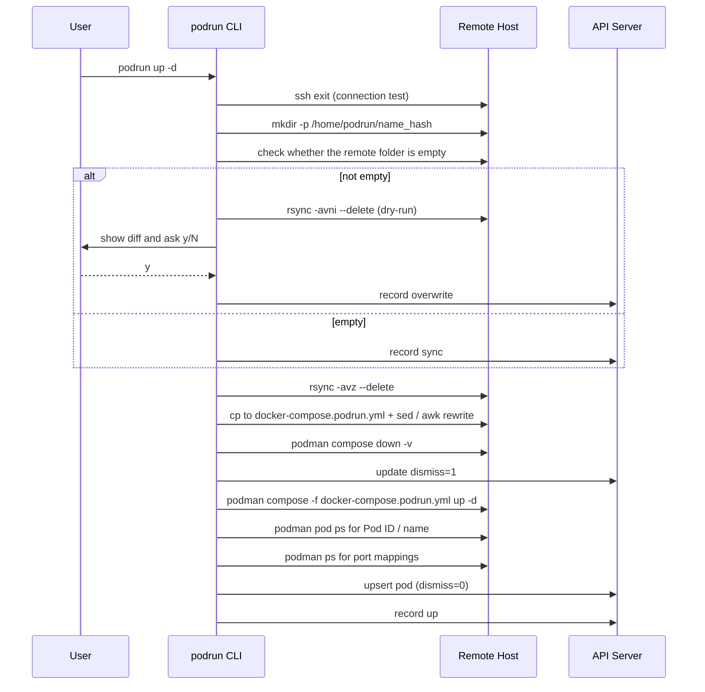
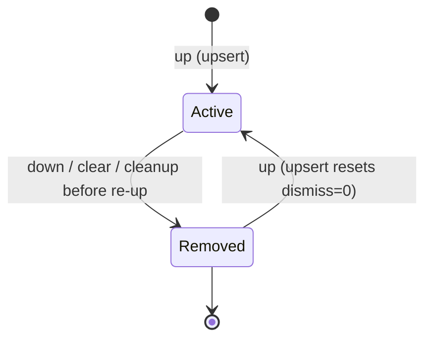

# PodRun - Architecture

Last updated: 2026-10-06

> Back to [README](../README.md)

## Overview



## Module: CLI Entry (cmd/cli)

Checks dependencies, environment variables, parses arguments, tests SSH, then dispatches the command.



## Module: command (internal/command)

Argument parsing, local/remote path derivation, and compose command execution.



## Module: utils (internal/utils)

Wraps `sshpass`-based commands and local host information lookups.



## Module: API Server (cmd/api + internal/handler + internal/database)

Gin routes backed by SQLite store deployments and operation records.

```mermaid
graph TB
    subgraph cmd/api
        Path{DB_PATH?} -->|set| Open
        Path -->|unset, /.dockerenv exists| Docker[/data/database.db] --> Open
        Path -->|unset| Home[~/.podrun/database.db] --> Open
        Open[NewSQLite<br/>runs sql/create.sql]
    end
    subgraph internal/handler
        Routes[NewRoutes :8080]
        Routes --> List[GET /api/pod/list]
        Routes --> Upsert[POST /api/pod/upsert]
        Routes --> Update[POST /api/pod/update/:uid]
        Routes --> Insert[POST /api/pod/record/insert]
        Routes --> Health[GET /api/health]
    end
    subgraph internal/database
        ListPods
        UpsertPod
        UpdatePod
        InsertRecord
    end
    Open --> Routes
    List --> ListPods
    Upsert --> UpsertPod
    Update --> UpdatePod
    Insert --> InsertRecord
    ListPods --> DB[(pods / records / domains)]
    UpsertPod --> DB
    UpdatePod --> DB
    InsertRecord --> DB
```

## Data Flow

Full flow of `podrun up -d`:



## State Machine

Transitions of `pods.dismiss`:



***

©️ 2025 [邱敬幃 Pardn Chiu](https://www.linkedin.com/in/pardnchiu)
