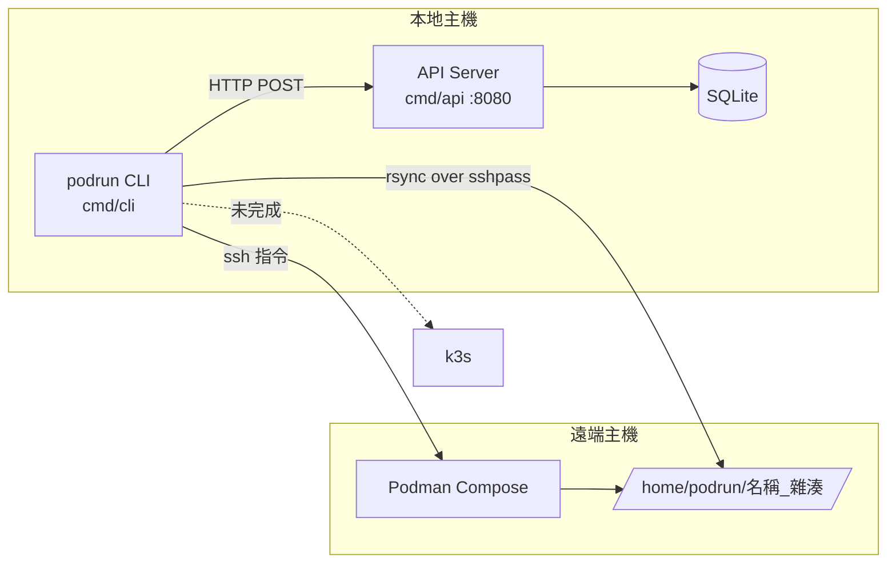
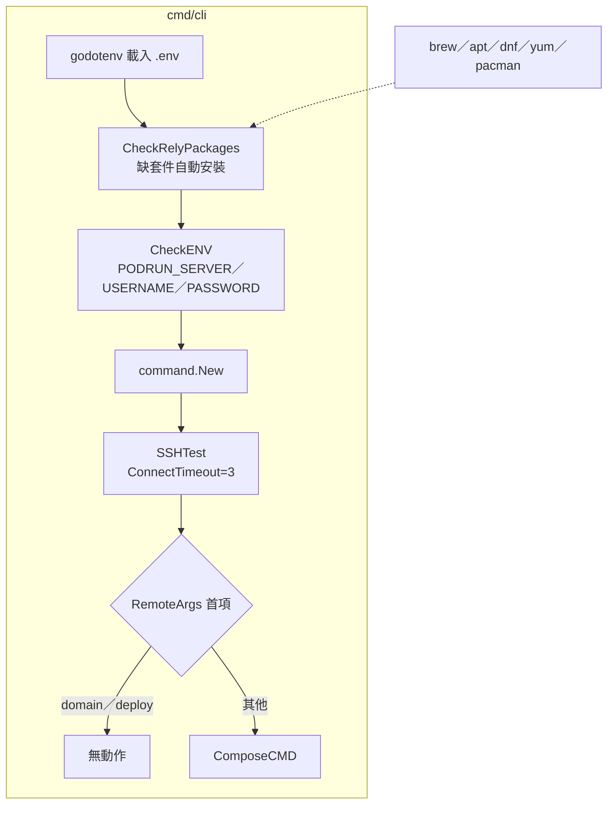
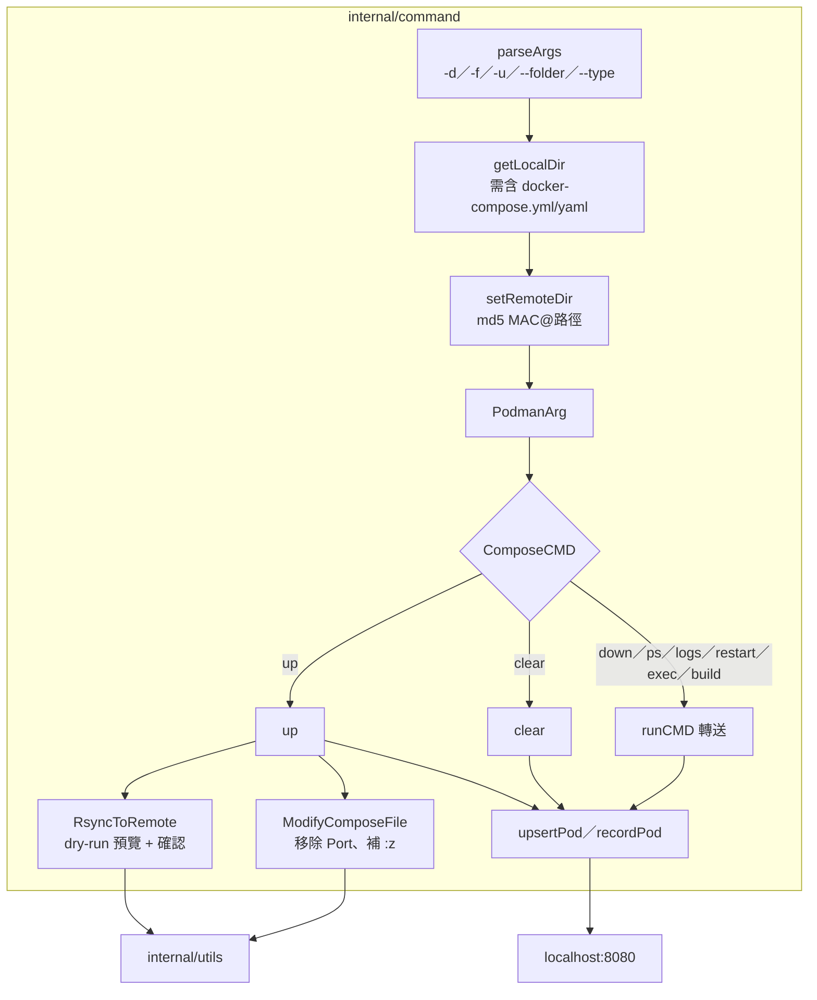
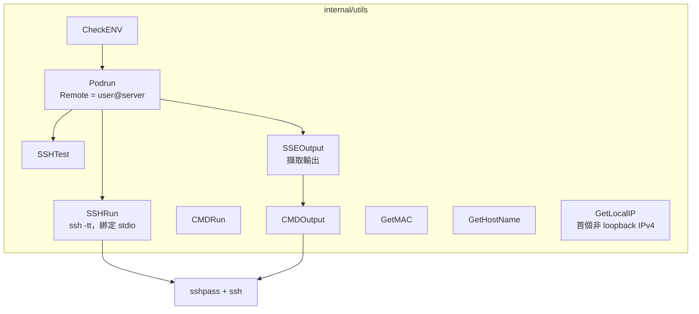
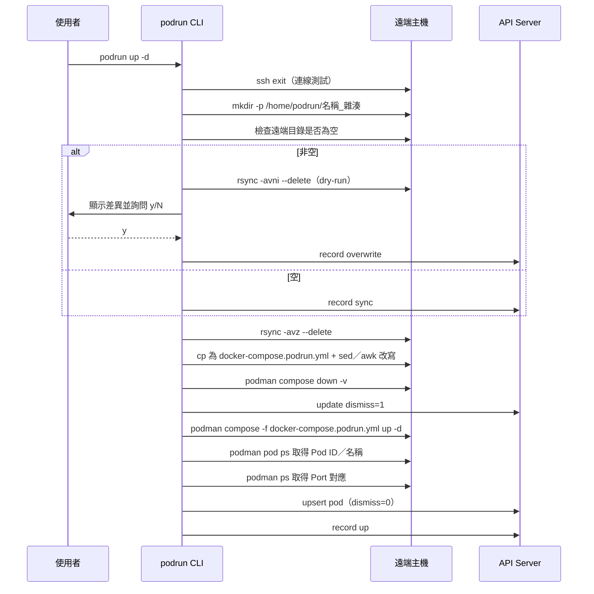
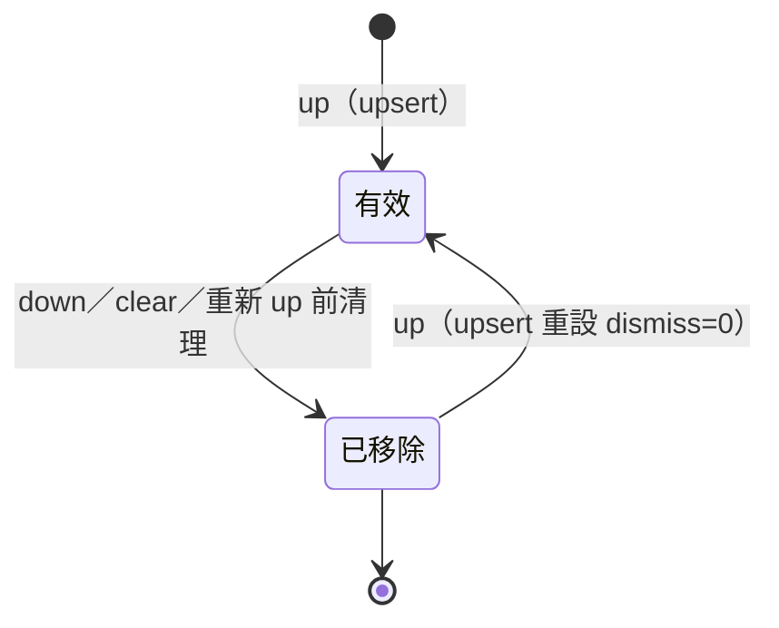

# PodRun - 架構

最後更新：2026-10-06

> 返回 [README](./README.zh.md)

## 概覽



## Module: CLI 入口（cmd/cli）

依序檢查依賴套件、環境變數、解析參數、測試 SSH，再分派指令。



## Module: command（internal/command）

參數解析、本地／遠端路徑推導與 compose 指令執行。



## Module: utils（internal/utils）

封裝 `sshpass` 系列指令與本機資訊取得。



## Module: API Server（cmd/api + internal/handler + internal/database）

Gin 路由搭配 SQLite 儲存部署與操作紀錄。

```mermaid
graph TB
    subgraph cmd/api
        Path{DB_PATH?} -->|有| Open
        Path -->|無，/.dockerenv 存在| Docker[/data/database.db] --> Open
        Path -->|無| Home[~/.podrun/database.db] --> Open
        Open[NewSQLite<br/>執行 sql/create.sql]
    end
    subgraph internal/handler
        Routes[NewRoutes :8080]
        Routes --> List[GET /api/pod/list]
        Routes --> Upsert[POST /api/pod/upsert]
        Routes --> Update[POST /api/pod/update/:uid]
        Routes --> Insert[POST /api/pod/record/insert]
        Routes --> Health[GET /api/health]
    end
    subgraph internal/database
        ListPods
        UpsertPod
        UpdatePod
        InsertRecord
    end
    Open --> Routes
    List --> ListPods
    Upsert --> UpsertPod
    Update --> UpdatePod
    Insert --> InsertRecord
    ListPods --> DB[(pods／records／domains)]
    UpsertPod --> DB
    UpdatePod --> DB
    InsertRecord --> DB
```

## 資料流

`podrun up -d` 的完整流程：



## 狀態機

`pods.dismiss` 的轉換：



***

©️ 2025 [邱敬幃 Pardn Chiu](https://www.linkedin.com/in/pardnchiu)
